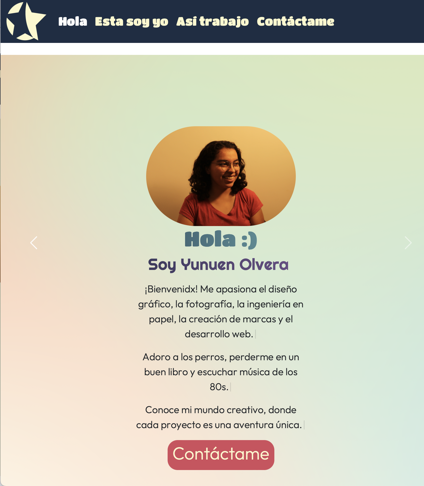

# Portafolio Desarrolladora front-end jr. 💼  

## Objetivo 🚀  
El objetivo de este proyecto fue practicar y desarrollar de manera integral nuestras habilidades en el lenguaje de programación, abarcando HTML, CSS y JS. Además, este proyecto nos permitió generar y consolidar nuestro portafolio de trabajo, creando una colección representativa de nuestras capacidades y logros. A través de la implementación de diversos ejercicios, buscamos no solo mejorar nuestras competencias técnicas, sino también demostrar nuestro crecimiento profesional y creativo en el ámbito del desarrollo front-end.

## Descripción 📚  
Realicé este proyecto a lo largo del mes de junio del año 2024, en el marco del curso intensivo TECNOLOchicas PRO Bootcamp. Durante este período, me dediqué a aplicar y expandir mis conocimientos en diversas áreas de la tecnología y la programación. El curso, diseñado específicamente para impulsar la participación de mujeres en el campo de la tecnología, me brindó una excelente oportunidad para aprender y practicar nuevas habilidades, culminando en la realización de este proyecto como una demostración de todo lo aprendido.  

  

[Visítalo](https://yunuenolvera.netlify.app)  

## Herramientas 🛠️
- HTML  
- CSS
- JS
- Bootstrap
- Typewriter JS
